## Semantic Segmentation 语义分割

我们希望得到图像中每个像素的类别，如下图：

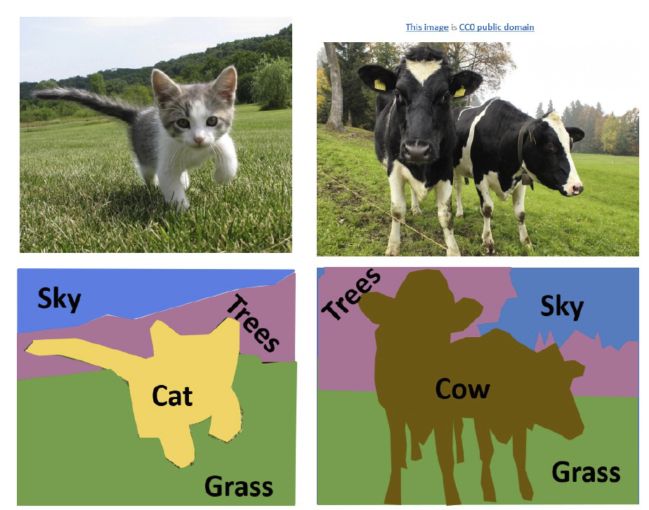

这就是一个逐像素分类的问题。前面已经讲过，用马尔可夫随机场的方法就可以对这个问题进行求解，下面我们将介绍一些使用深度学习的方法。

注意到，在这里滑动窗口会使数据量变得很大，训练速度也会下降，因此全卷积网络（fully convolutional network）如今是一个非常常用的方法。只需要过一遍卷积网络就可以计算出结果，其损失函数是逐像素的交叉熵：

注意到，我们的输出图像应该和输入图像长宽相同，这样会自然而然地引入两个问题：一方面，过小的卷积核导致计算速度下降，另一方面，感受野也不够大。于是我们加入池化（pooling）和去池化（unpooling）的方法：

这样一方面可以加快计算速度，一方面可以增大感受野。在最后我们完成了一次去池化和一次卷积来得到结果，这被称为 transposed convolution 。我们称这种网络结构为 U-Net 或者漏斗网络（hourglass network），其中可能带有一些跳跃连接（skip connection），完整结构如下图：

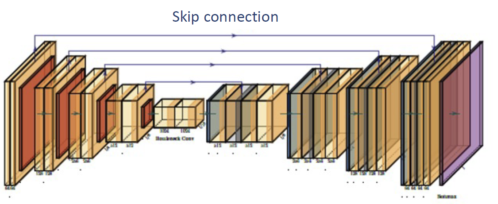

现在常用的开源软件是 DeepLab ，它在 U-Net 的基础上加了两个优化：

1. 使用空洞卷积网络（atrous convolution）
2. 在输入前引入条件随机场（conditional random field）

其整体流程如下图：

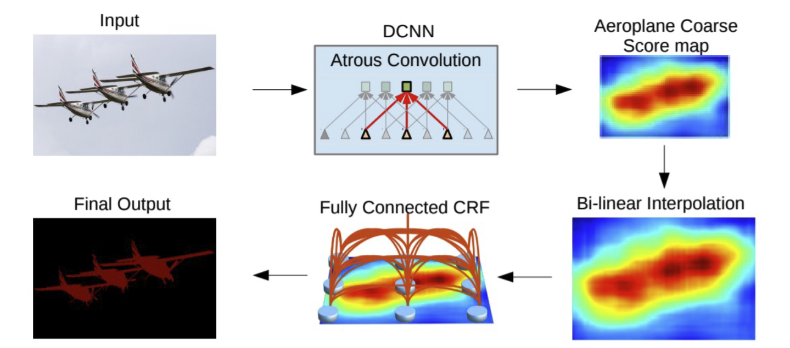

对于这种任务，如何对结果的好坏进行测量？最常用的度量手段是 IoU（per-pixel Intersection-over-union），对每个类别用并集的面积去除交集的面积，然后对整张图求平均，就能得到整张图的 IoU，如下图：

## Object Detection 目标检测

在这个任务中，我们的输入是 RGB 图像，输出是一系列指示物体的有界边框（物体类别，位置和宽高）。由于我们不知道有界边框应该有多少个，我们不能简单地直接设计一个输入-输出的网络。对于不同的物体，我们输出的数目也应该是不同的。当前有一些基于 transformer 的方式来解决这个问题，但是这里我们介绍一些更加主流的方式。

最简单的一个想法是滑动窗口。穷举不同的框和不同的位置，对每个图像的切片进行分类，但是这样是非常慢的。进一步的一个想法是先给出一些区域候选框（region proposal），然后再对这些候选框进行检测。生成候选框的传统方式有很多，例如 over-segmentation，往往都是基于启发式算法的。

接下来我们对每个候选框进行检测，常用的方法是 R-CNN，其框架如下图：

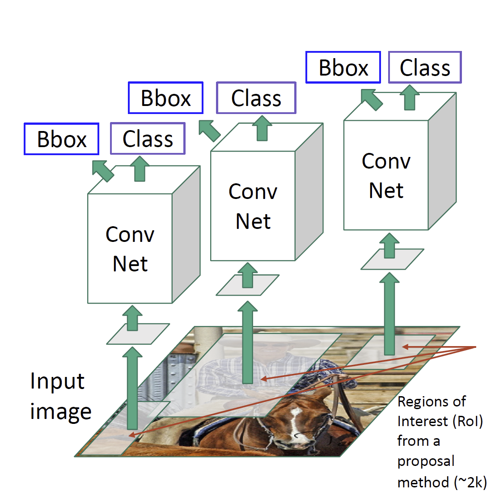

我们同样使用框与框之间的 IoU 来衡量训练的好坏。这里还有一个问题，对于同一个物体，我们可能出现不同的框，如下图：

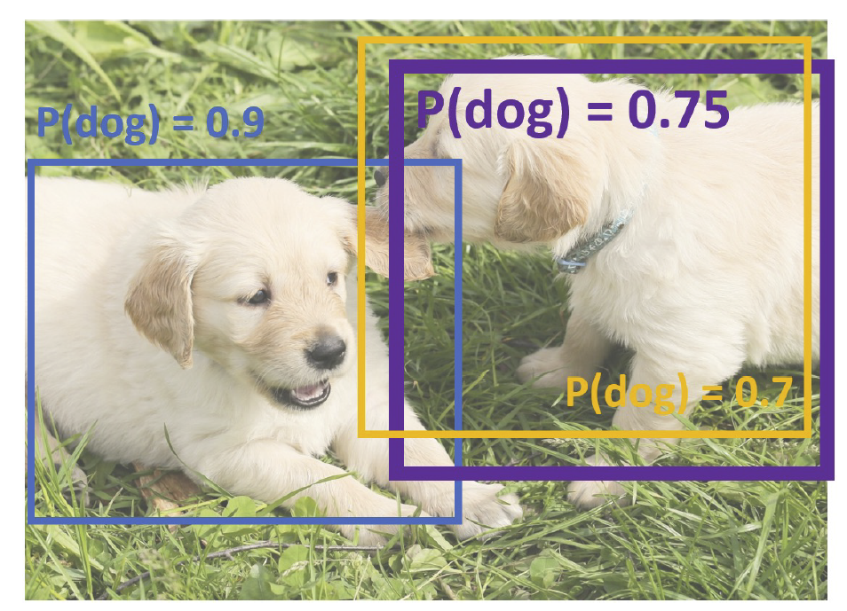

我们使用非最大值抑制（non-max suppression）的方法处理这种问题。首先，选择一个得分最高的框，然后去掉与之 IoU 超过阈值的框，这些框的得分比它更低；如果还有更多的框，则回到上一步。

但是，R-CNN 还是需要将每个框单独过一遍网络（一般称为骨干网络，backbone），这样导致速度还是太慢了。于是我们发明了 Fast R-CNN 的方法，首先将图片过一个网络得到特征图像，然后对特征图像中的候选框进行检测。这样的过程显著加快了网络训练的过程，如下图：

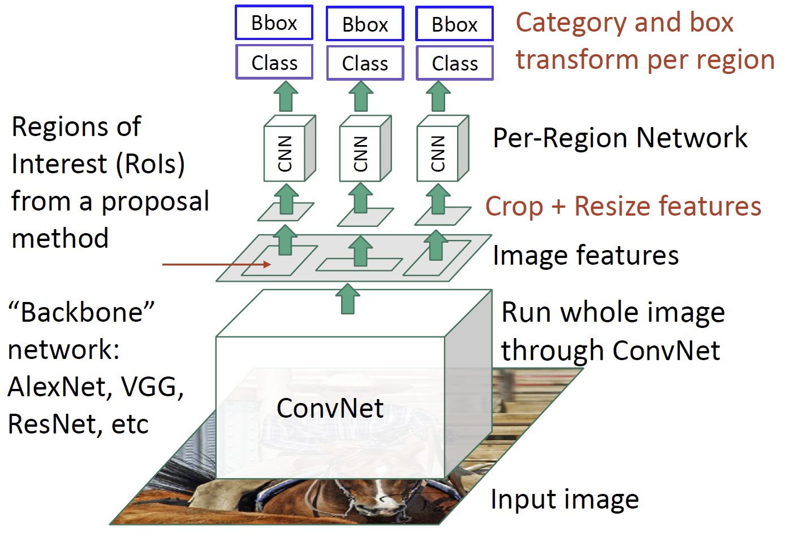

然后我们注意到，传统的候选框生成方式是比较慢的，因此，我们尝试再特征图像上直接生成候选框，这个网络被称为区域候选框生成网络（region proposal network, RPN），整个结构被称为 Faster R-CNN。它首先在特征图像的锚点上生成一些框（称为 anchor box），然后利用卷积神经网络来生成另一个特征图像，其生成的东西是哪些方框的得分较高，这样来得出是否能获得一个好的候选框，并给出更加精细的位置，如下图：

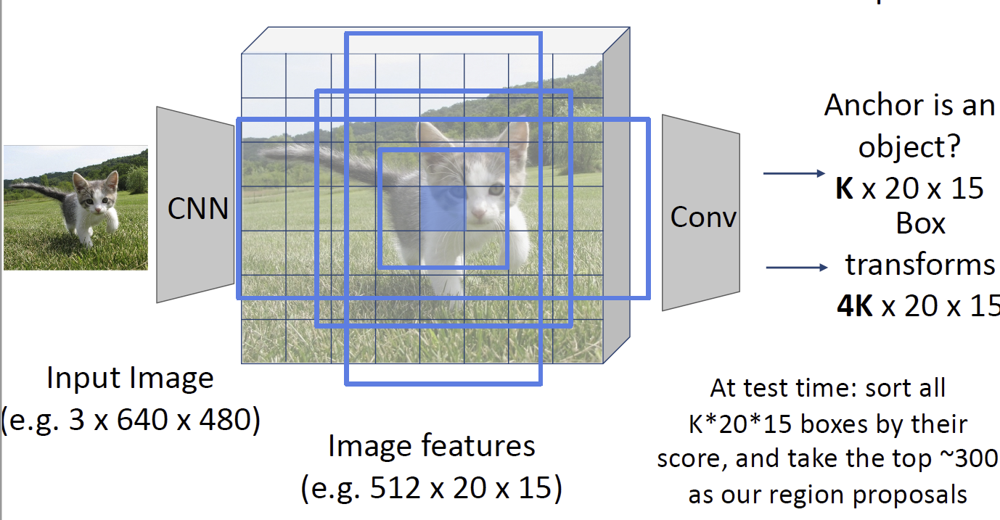

像 Faster R-CNN 这种方式我们会称之为两阶段目标检测器（two-stage object detector），它第一阶段生成 proposal，第二阶段对 proposal 进行分类。近年来单阶段（single-stage）的目标检测器逐渐兴起。注意到在上面的 RPN 结构中，我们分割完之后事实上已经做了一次分类，因此在这里我们不妨直接进行分类，这就是单阶段检测器的基本思路。YOLO 就是其中的一个典型例子。单阶段检测器的精度相对较低但是速度较快，双阶段则与之相反。

## Instance Segmentation 实例分割

这个任务事实上是上面两者的组合。我们首先需要识别出图像中的物体，然后得到一个对每个物体的逐像素的分类。它和目标检测的差别在于它需要区分出同一类别的多个实例。

最简单的一个想法就是，先进行目标检测，再对每个框进行语义分割，也就是 Faster R-CNN 的一个修改，Masked R-CNN，如下图，就是在检测完之后添加了一个预测过程。

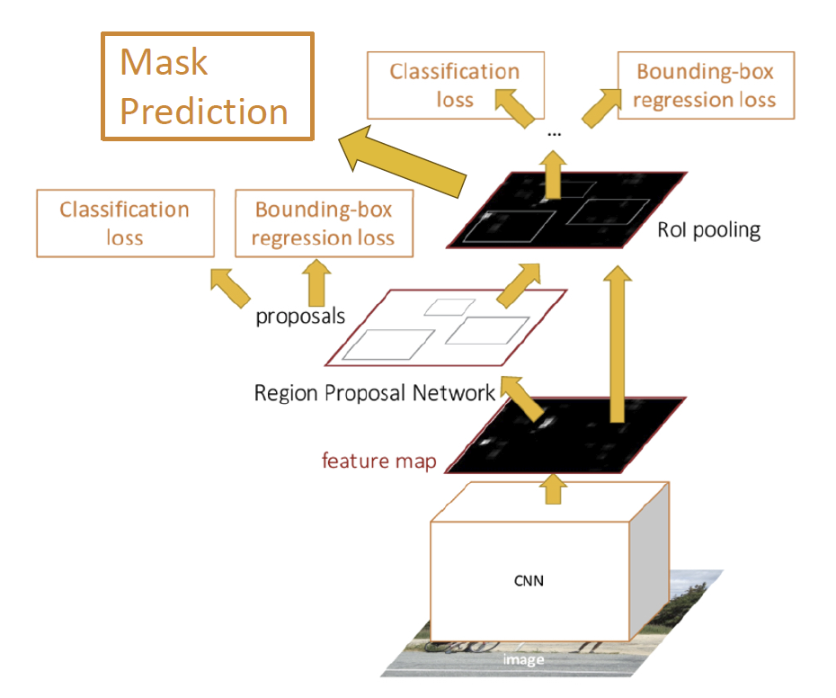

传统的目标检测方法一般被称为蛇形方法（Snake）方法，是优化一个多边形框使得其接近一个物体的轮廓，如下图：

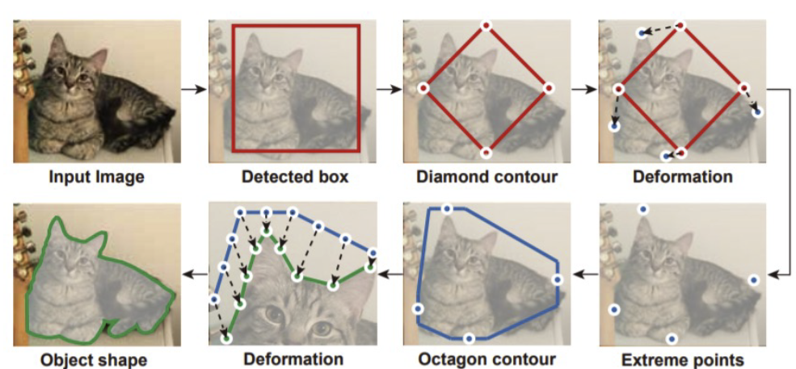

当然，我们也可以使用深度神经网络来优化，这种方法被称为 deep snake。

另一个任务为全景分割（Panoptic segmentation）。这时我们需要对图像的所有实例与背景都进行分割，常用的方法就是以上的方法的结合。

这些任务的一个常见的数据集是 Microsoft COCO 数据集，可以用于目标检测、关键点检测、实例分割和全景分割。

## Human Pose Estimation 人体姿势估计

做物体姿态识别时，因为它是不可形变的物体，所以我们用六个自由度就能将其描述；但对于人体而言，我们就不能这么简单地处理，我们需要用骨架来描述。在描述过程中，我们一般会选取关键点，一种常用的方式是选取 17 个关键点，如下图：

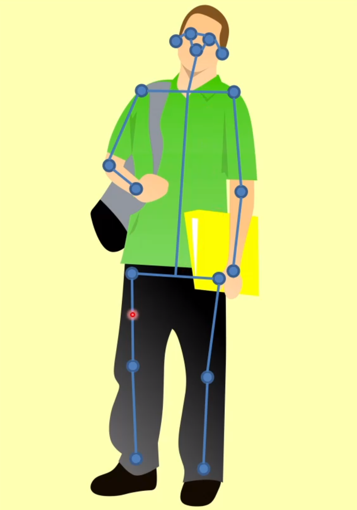

我们接下来的问题就是关键点定位的问题。最早的想法是利用深度摄像头，例如微软的 Kinect 摄像头。基于深度图来识别人体关键部位是比较简单的。

对于单人而言，我们使用一个被称为 Deeppose 的网络来处理这种拟合，它是 2014 年的工作，使用如下网络结构：

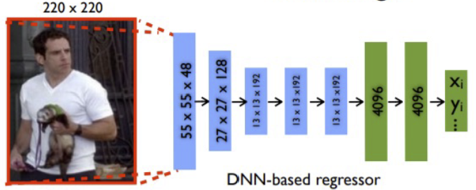

更好的一种方式是使用热力图（heatmap）的方式来表示，我们使用全连接的卷积神经网络将一张图片转化成十七张图片来表示关键点的位置，这种方式是更容易用深度神经网络来进行预测的，因为卷积神经网络天生地有利于进行图片生成。下图表明了使用多个 U-Net 进行关键点识别的网络结构。

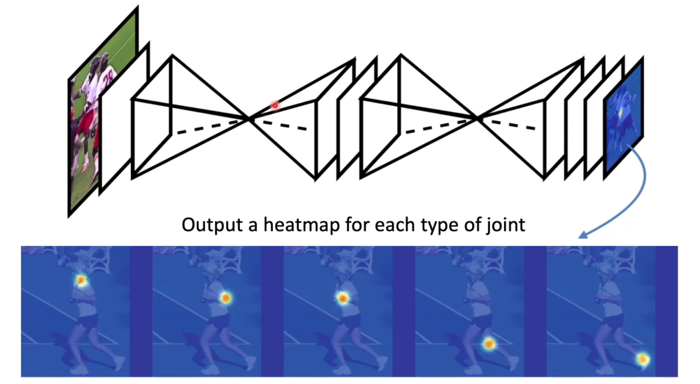

对于多人的情形，一种方式是自顶向下的（top-down），典型的例子就是 Mask R-CNN，首先将人分隔开，然后再使用关键点检测，但这样的过程还是比较慢的。因此另一种方式是自底向上（bottom-up）的，首先检测出关键点，然后再将关键点进行组合。这样因为只需要过一遍网络，所以速度快得多，典型的工作是 OpenPose。在组合的过程中，利用神经网络还回归了一个被称为部分亲和性场（part affinity field）的向量场，用来表明关键点之间的连接关系。关键点和亲和性场都是使用全卷积神经网络进行回归的。

如何在自顶向下和自底向上的方法之间做出选择？自顶向下的方法的精度比起自底向上的方法更高，但是自底向上的方法速度一般比较快。另外，当人体被遮挡的时候，自底向上的方法往往能获得更好的结果，因为在一个框中我们有可能会有多个人的关键点，但每个框只输出 17 个关键点，因此可能会出现关键点丢失的问题。

## Video classification 视频分类

输入一个视频，我们想要识别其中人体的动作之类的信息。最简单的想法是使用三维的卷积网络，如图：

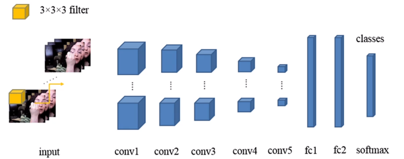

更复杂的问题是时序动作定位（temporal action localization），给定一个未剪辑的视频，给出某段时刻在做什么动作；如果还要给出某个局部发生动作的信息，就变成了时空检测（spatial-temporal detection）。这些问题现有的解决方案类似于 R-CNN，但是复杂的多。

对多个物体进行跟踪（multi-object tracking）要求识别并追踪多个不同类别的物体。一般的方法是对每个帧做目标检测，提取特征并在多个帧之间做对照。当然，还有一些更加复杂的方法来解决这个问题。